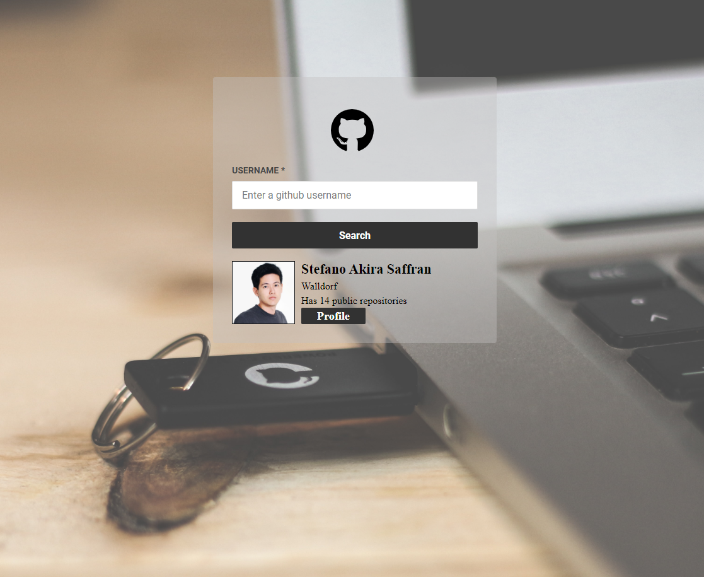

<h1 align="center">
  Fetch github users profile
</h1>

<h3 align="center">
  Rocketseat starter - ES6 Session
</h3>

### This is a study project only and was developed following the ES6 course from Rocketseat :books:

You can see the results <a href="https://condescending-pasteur-70550a.netlify.com">here</a>

## :rocket: Built with

- [JavaScript](https://www.w3schools.com/js/)
- [Webpack](https://webpack.js.org/)
- [Babel](https://babeljs.io/)
- [Axios](https://github.com/axios/axios)
- [CSS3](https://www.w3schools.com/css/)
- [HTML5](https://www.w3schools.com/html/)
- [Font Awesome](https://fontawesome.com/)

## :mailbox_with_mail: Get in touch!

[LinkedIn](https://www.linkedin.com/in/stefanosaffran/) | [Website](https://stefanosaffran.com)
